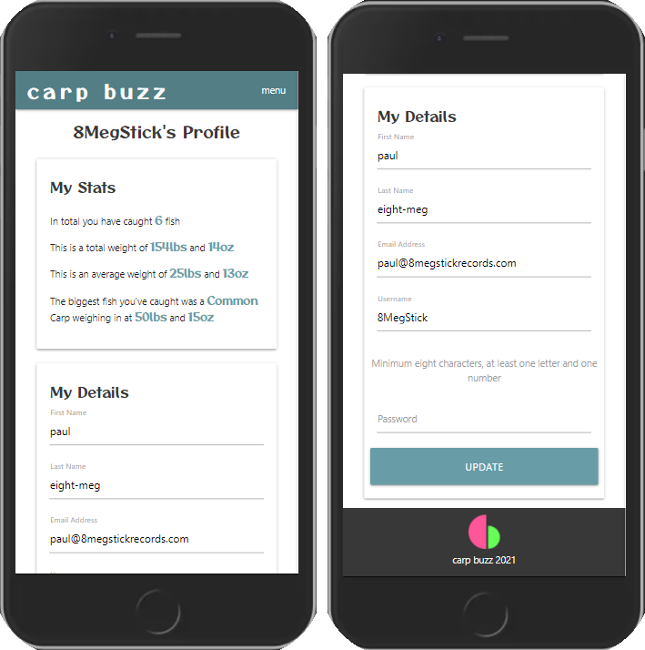

# Carp Buzz

>
> Carp Buzz is a directory of fisheries in the South West of England.
>

The live site has been deployed to https://carp-buzz-dev.herokuapp.com/

<!-- TOC -->

- [Carp Buzz](#carp-buzz)
    - [User Experience UX](#user-experience-ux)
        - [User Stories](#user-stories)
- [Wireframing](#wireframing)
    - [Website Architecture](#website-architecture)
        - [Database](#database)
        - [Application](#application)
        - [Frontend](#frontend)
        - [Security](#security)
    - [Design Choices](#design-choices)
    - [Technologies](#technologies)
        - [Languages Used](#languages-used)
        - [Frameworks, Libraries, Databases & Programs Used](#frameworks-libraries-databases--programs-used)
    - [Testing](#testing)
        - [Testing User Stories from User Experience UX Section](#testing-user-stories-from-user-experience-ux-section)
            - [All Users](#all-users)
            - [Registered Users](#registered-users)
            - [Administrator](#administrator)
    - [Deployment](#deployment)
        - [To contribute to the project](#to-contribute-to-the-project)
        - [Clone and Run Locally](#clone-and-run-locally)
        - [Deploying to Heroku](#deploying-to-heroku)
    - [Bugs and issues](#bugs-and-issues)
    - [Future development](#future-development)
    - [Acknowledgements](#acknowledgements)

<!-- /TOC -->

## User Experience (UX)

### User Stories

Working with the founder of Carp Buzz the following personas and user stories have been identified:

>
> All Users
>

- As someone who wants to go carp fishing, I can easily view a directory of fisheries in the South West of England
- As someone who wants to go carp fishing, I can filter a directory of fisheries in the South West of England based on location
- As someone who wants to go carp fishing, I can view useful information for that fishery such as contact details, ticket prices, stock sizes and facilities
- As someone who wants to go carp fishing, I can view any reviews a fishery has
- As someone who wants to go carp fishing, if I read a review that  has questionable or offensive text I can report the review to the website administrator
- As someone who wants to go carp fishing, I can view any catch reports a fishery has
- As someone who wants to go carp fishing, if I have any questions or queries and can send a message to Carp Buzz

>
> Registered Users
>
- As someone who has been carp fishing and who is registered to the site, I can leave a review of a fishery that I visited
    - I can edit my reviews at a later date
    - I can delete my reviews
- As someone who is currently carp fishing and who is registered to the site, I can log the fish I catch on my fishing trip
    - I can easily add fish individually as I catch them
    - I can view this report at a later date
    - I can amend this report at a later date
    - I can delete my reports
- As someone who has been carp fishing and who regularly used the site to record my catch details, I can log and view the details of what i have caught
- As someone who has registered for the site I am able to change my own account details
    
>
> Administrator
>
- As an administrator of the site, I can add new fisheries to the directory
- As an administrator of the site, I can amend existing fishery entries
- As an administrator of the site, I can delete fisheries from the directory
- An administrator of the site, I can moderate fishery reviews when notified by someone who uses the “report review” function.
    - I can deleted the review
    - I can remove the review from moderation should it be OK to do so
- As an administrator of the site, I can view any messages that have been sent using a contact form

These user stories helped inform a feature backlog that is kept in [Trello](https://trello.com/b/xP7HGN7D/carp-buzz). This also informed what the minimum viable product was for the project.

## Wireframing

Mocking up of the site was done using Figma collaborating with Carp Buzz founder Ben Hesketh.

The features outlined in the MVP were used to shape the wireframe images. After review it was decided to keep the filter option on the main fisheries view to just the county the fishery is located in as this presented a cleaner interface.

[Figma Wireframes](https://www.figma.com/file/3G7nX6FtgMuFxYMjBPjuQc/Carp-Buzz?node-id=0%3A1)

## Website Architecture

### Database

Data for Carp Buzz is stored in a MongoDB document database called carp+buzz.

This database is segregated in to 9 collections.

- fisheries.contact
- fisheries.facilities
- fisheries.payment
- fisheries.tickets
- accounts
- reviews
- catch.reports
- catch.fish
- messages

The fisheries collection is broken down in to the 4 sub-collection you see above following best practice. The fisheries.contact can be considered as the primary collection as the individual documents generate the ID that links the the other subcollections. This fishery ID is also used to link the reviews collection and both of the catch collections.

When a fishery is deleted by an administrator the fisheries.facilities, fisheries.payment and fisheries.tickets are removed whilst fisheries.contact is given a hidden value and remains in the collections. This keeps the integrity of the catch.report and catch.fish data.

The catch collection is divided in 2 so that fish caught are indivually recorded making further enhancements using the data possible such as returning fish date georaphically or returning information based on type or size.

https://lucid.app/lucidchart/invitations/accept/inv_7b410190-ce33-47a5-80bd-387f7c72f0c6

### Application

The application is build on the [Flask](https://flask.palletsprojects.com/en/2.0.x/) framework and uses Python to interface with MongoDB and to present data to the frontend.
### Frontend

As the site is built upon the Flask framework the application is reliant on the [Jinja](https://jinja.palletsprojects.com/en/3.0.x/) templating language and is designed to be a single page application. This means individual pages do not need to be re-loaded in order to view updated content.

To render the card layout shown in the wireframes MaterializeCSS was chosen for the structural framwork for the HTML and CSS code.

### Security

Security is provided through the [Werkzeug](https://werkzeug.palletsprojects.com/en/2.0.x/) application library. This facilitates specific identity access management to features and pages. These specific account requirements are implemented both on the UI and at the python function level.

## Design Choices

The website has been built as a mobile first site.

The Materialize side-nav was chosen to enhance the mobile experience. The word menu was chosen above using the burger icon for usability purposes.

The h1 and h2 heading and Carp Buzz font was changed from 'Questrial' to 'Otomanopee One' to give a less corporate feel following feedback from users.

Below is the brand colour pallet for Carp Buzz. A complimentary colour pallet was used in relation to the brand colours.

| Description | Hex Colour Value |
| --- | ----------- |
| Carp Buzz primary Colour Blue  | #689DA8 |
| Carp Buzz secondary colour green | ##89A857 |
| Off white used for backgrounds or light text | #f7f7f7 |
| Dark grey primarily used for font colour | #383838 |

The Carp Buzz logo was removed from the menu bar as it overcomplicated the look of the navigation.

The card to display fishery information was designed to host a significant amount of information. Having the expandable element helped keep this view clear without taking up too much screen height per fishery.

Bold Materialize colours were used for the functional buttons on the app to help usability.

## Technologies

### Languages Used

- [HTML5](https://en.wikipedia.org/wiki/HTML5): Is used to structure the website
- [CSS3](https://en.wikipedia.org/wiki/CSS): Is used for the styling of the site
- [Python](https://www.python.org/): Is used to program the functionality of the application
- [Jinja template language](https://jinja.palletsprojects.com/en/3.0.x/) Is used to render the data passed to it to the DOM
- [JQuery](https://jquery.com/): Is used to initialise several Materialize CSS components

### Frameworks, Libraries, Databases & Programs Used

- [Flask](https://flask.palletsprojects.com/en/2.0.x/): Flask is used as a programming framework 
- [Materialize](https://materializecss.com/): CSS framework used to speed up design, layout and build of the website 
- [Werkzeug](https://werkzeug.palletsprojects.com/en/2.0.x/): Is used for the security elements of Identity Access Management
- [Google Fonts](https://fonts.google.com/): Google fonts were used to import the 'Otomanopee One' and 'Questrial' fonts
- [Font Awesome](https://fontawesome.com/): Font Awesome was used for any icons
- [Git](https://git-scm.com/): Git was used for version control by utilizing the Gitpod terminal to commit to Git and Push to GitHub
- [GitPod](https://www.gitpod.io/): GitPod was used as the initial development environment
- [Microsoft VS Code](https://code.visualstudio.com/) Was used after the application development was started in GitPod after the monthly time usage had expired
- [GitHub](https://github.com/): GitHub is used to store the projects code after being pushed from Git
- [Figma](https://www.figma.com/): Figma was used to create the wireframes during the design process

## Testing

A code review was posted in the Code Institute peer-code-review channel.

A number of people I know carried out user testing. This resulted in a number of bugs found and fixed and usability improvements.

### Validation
Python code was tested for PEP8 compliancy with no issues http://pep8online.com
HTML was tested though https://validator.w3.org/ by copying and pasting in the page source for each page. This raised on error that I've accepted.
Accepted error:

Each error is generated from a select element that does have a unique id. Therefore it is not a multiple selection is a single selection element.

### Testing User Stories from User Experience (UX) Section

#### All Users
>
> As someone who wants to go carp fishing
>

- I can easily view a directory of fisheries in the South West of England
    1. Upon landing on the website the user is presented with a clean site containing imagery and text that indicates that this is a carp fishing site
    2. There is a statement 65% of the way down the screen that states how many fisheries are available to view. This defaults to the total number of fisheries in the database in alphabetical order
    3. 1 fishery will be in part view
    

- I can filter a directory of fisheries in the South West of England based on location
    1. The user is presented with the ability to filter the directory based on what county the fishery is in
    2. There is a statement 65% of the way down the screen that states how many fisheries are now available to view.
    3. 1 fishery will be in part view

- I can view useful information for that fishery such as contact details, ticket prices, stock sizes and facilities
    1. Each fishery card displays contact information and ticket price by default
    2. More information is clearly marked. When this is clicked additional information is displayed

- I can view any reviews a fishery has
    1. Each fishery card contact has a reviews button
    2. When clicked the reviews for that fishery are displayed if there are any. The page will state if there are no reviews

    
- if I read a review that has questionable or offensive text I can report the review to the website administrator
    1. If the review contains any information that the reader sees as questionable they are able to report the review to the website administrators
    2. A flash message will indicate that they review has been reported

- I can view any catch reports a fishery has
    1. Much like reviews each fishery card contains a reports button
    2. When clicked the reports for that fishery are displayed, if there are any. The page will state if there are no reports    
- if I have any questions or queries and can send a message to Carp Buzz
    1. There is a contact link on the menu
    2. When on the contact page there is a simple form that allows anyone to send a message to the website
#### Registered Users
>
> As someone who has been carp fishing and who is registered to the site
>

- I can leave a review of a fishery that I visited
    1. If the user has logged in to the website, when on the reviews section for a fishery, they will be able to add a new review via a very clear button at the top of the page
    2. The user is then presented with a clear and simple for them to leave their review
- I can edit my reviews at a later date
    1. If the user has already left a review for a fishery the user will be able to edit this review by a large clear 'edit this review' button.
    2. The user is able to change all aspects of their review

   
- I can delete my reviews
    1. Also within the edit section there is a clear delete button
    2. To avoid accidental deletion the button opens a second prompt to confirm the deletion
>
> As someone who is currently carp fishing and who is registered to the site
>

- I can log the fish I catch on my fishing trip
    1. If logged in to the site a user can add a catch report via a very clear button at the top of the reports page of a fishery
- I can easily add fish individually as I catch them
    1. Once the report has been created the user will be taken to a form where they can add the individual fish caught as they catch them
        1. The type of fish is restricted to types of carp only
        2. Weight is captured in pounds and ounces
- I can view amend this report at a later date
    1. Within the reports page the user can clearly see which are their report and can be edited via a large clear 'edit this report' button
    2. Once in the report all aspects can be edited
    3. The user can also re-enter the add fish page to add more catches
- I can delete my reports
    1. Also within the edit section there is a clear delete button
    2. To avoid accidental deletion the button opens a second prompt to confirm the deletion

- As someone who has been carp fishing and who regularly used the site to record my catch details, I can log and view the details of what i have caught
    1. If the user is logged in a profile page link is available in the menu
    2. On this page there is a summary of what they have caught
- As someone who has registered for the site I am able to change my own account details
    1. On the profile page there is a form to enable to the user to change their details

#### Administrator
>
>As an administrator of the site
>

> Admin tools are only available when logged in as a user with admin credentials

- I can add new fisheries to the directory
    1. When logged in as an administrator the user can click on the Admin link located in the menu
    2. The first link in the drop down is Add Fishery
    3. This open a large form where the details of the fishery can be completed, or partially completed with a view to adding additional items at a later date
    
 

- I can amend existing fishery entries
    1. An edit icon for each fishery can be found in the top left hand corner of the more information for that fishery
    2. When the user click on this icon they are take to the edit page for that fishery
    3. All details can be changed as needed
- I can delete fisheries from the directory
    1. Also there is a clearly marked delete button.
    2. To avoid accidental deletion the button opens a second prompt to confirm the deletion
    

    
- I can moderate fishery reviews that have been notified by someone who uses the “report review” function.
    1. In the Admin menu there is a link to Moderate Reviews
    2. This page allows the admin to read the review and ascertain if the review should be kept or removed
- I can deleted the review
    3. At the foot of each review is two buttons. One to delete the review
- I can remove the review from moderation should it be OK to do so
    4. And one to keep the review

    
- As an administrator of the site, I can view any messages that have been sent using a contact form
    1. In the Admin menu there is a link to messages received from the contact form on the contacts page
    2. This page displays all the messaged that have not been marked as hidden
    3. If no longer needed the message can be hidden via the 'hide message' button at the foot of each message

## Deployment

### To contribute to the project

1.	Navigate to the Carp Buzz repository page in GitHub https://github.com/PaulWheatcroft/CarpBuzz
2.	In the top right corner click Fork
3.	This creates a copy in your GitHub repository 
4.	From here you could open in Gitpod or make changes directly in GitHub. Once completed click New Puss Request to submit your changes to be merged with the master branch

### Clone and Run Locally

The Carp Buzz application runs on a MongoDB database and requires environment variables. These are kept in a file called env.py which is not shared through GitHub to protect the Carp Buzz database.
Before cloning the repository, you will need to set up a MongoDB account if you do not already have one (https://www.mongodb.com/). Then inside a MongoDB cluster set up a database with the name of your choice and then create collections outlined in the Website Architecture>Database section of this README file.

 
You can find the clone string for the repository in Code button above the project’s files.
Most IDE application have a GUI interface for cloning a GitHub repository from this string.
For instance in VS Code:

 

 
> Alternatively the repository can be cloned from the terminal of your IDE
> 1.	Open the terminal
> 2.	Change the current working directory to the location where you want the cloned directory.
> 3.	Type git clone, and then paste the URL you copied earlier.
>   git clone https://github.com/YOUR-USERNAME/YOUR-REPOSITORY
> 4.	Press Enter to create the local clone.

Once the clone has completed (though either method) you should see a requirements.txt file in the route of the directory.

> 5.	In the terminal run
pip install -r requirements.txt

Once the repository is cloned you can set up your env.py file in the root of the website but make sure it isn’t replicated to your GitHub repository

> import os	
>
>	os.environ.setdefault("IP", "0.0.0.0")
>	os.environ.setdefault("PORT", "5000")
>	os.environ.setdefault("SECRET_KEY", "password_of_your_choice")
>	os.environ.setdefault("MONGO_URI", "")
>	os.environ.setdefault("MONGO_DBNAME", "your_database_name")

You will find the MONGO_URI string in the connection section of your cluster. Make sure you are using Python 3.6 or late and copy the string into the environment variable.

You should now be able to run the website from your computer.

### Deploying to Heroku

To deploy to Heroku (https://www.heroku.com/ )
1.	Log in with your account
2.	Select New
3.	Then Create new app
4.	Give your app a unique name and choose you local region
5.	The click Create app
6.	When the app is created go to Setting
7.	Click on Reveal Config Vars and enter the 5 environment variable that are set in the 

8.	Now navigate to Deploy and click on Connect to GitHub
9.	Authenticate to your GitHub repositories and select the correct GitHub repository for this project.
10.	Click on Deploy Branch to make the application available publicly through Heroku

## Bugs and issues

## Future development

Near term changes needed
- The user profile page needs to be more interactive with their data, date rangers, by fishery, number over a size, by type etc
- Deleting reviews from the Admin page needs an "are you sure" modal
- Messages page needs a display hidden messages toggle and a delete button

Longer term changes
- Filtering for a fishery based on current user location and distance away from that location
- Heat map of fish caught
- Ability to follow a fisheries reports via push notifications
- Ability to follow another user
- Facility to upload images

## Acknowledgements

The project was started using the The Code Institute's [Gitpod Full Template](https://github.com/Code-Institute-Org/gitpod-full-template).

Border https://www.steckinsights.com/shorten-length-border-bottom-pure-css/ 

Cancelling of flash messages https://stackoverflow.com/questions/57660542/flask-closing-flash-message

https://smartmockups.com/ was used for the image in the README

